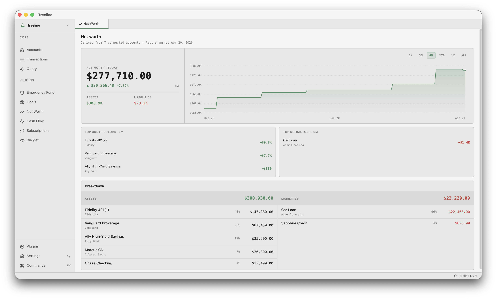
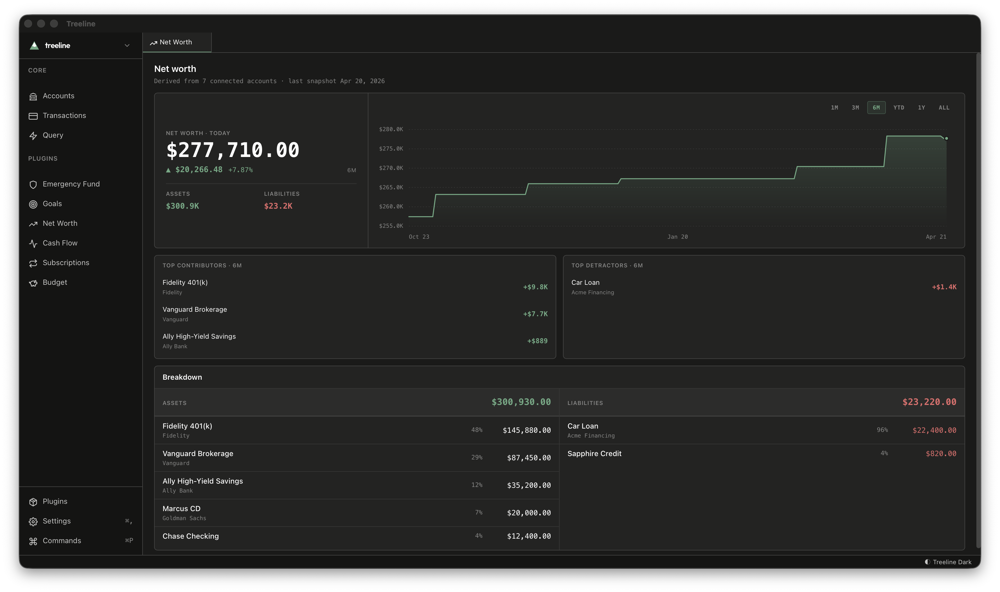

Track your net worth over time across every account — cash, investments, credit cards, loans.

## How it works

Your accounts already have balances and balance history. The plugin computes net worth from those — assets minus liabilities — and charts it over whatever window you pick. No extra setup.

## What you'll see

- **Trend chart** - Net worth over the last month, quarter, year, or all-time
- **Period change** - How much you're up or down over the selected window, in dollars and percent
- **Top movers** - Which accounts contributed or detracted the most
- **Breakdown** - Drill into assets and liabilities by account, or group by portfolio asset class (cash, investments, retirement, credit, loans)

## Getting started

Connect or manually add your accounts. The plugin reads balance snapshots from your accounts — if you sync through an integration or set balances manually, history accrues automatically. Switch the time range or the breakdown mode from the top of the view.
